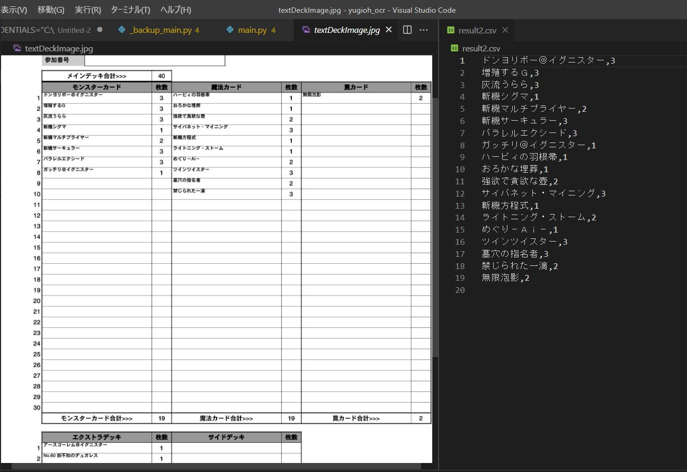
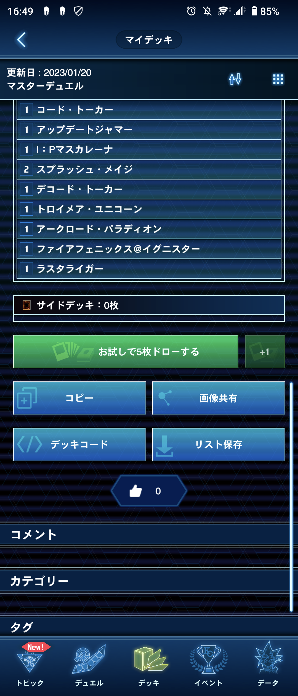

# 遊戯王ニューロンOCR
遊戯王ニューロンから出力されるデッキリストの jpeg 画像を csv 形式のテキストデータに変換するプロジェクト  

画像内左図：遊戯王ニューロンからの出力されたデッキリスト  
画像内右図：csv 形式に変換後のデッキリスト  

## Quick Start
### 1. Google Vision API の設定
このプログラムでは、Google Vision API を利用するため、その設定を行う  
Web 上で Google Cloud に登録し、API key をダウンロードする  
参考：  
https://dev.classmethod.jp/articles/google-cloud_vision-api/

### 2. Google Vision API key の登録  
ダウンロードした API key のパスを Makefile 4行目に記述する

### 3. 実行
```shell
    make run
```
サンプルとして用意した textDeckImage_sample.jpg を入力として、result.csv にテキストデータが出力される

## Advanced
### 入力画像の変更
main.py 内 27 行目に入力画像ファイル名が記述してあるので、それを書き換える  
### 入力画像の入手
スマートフォンで遊戯王ニューロンを起動し、対象となるデッキを選択してから以下の"リストを保存"を選択  


### カード名リストの取得・更新 (TODO)
このプログラムでは、遊戯王全カード名リストを使って、文字認識を補正している  
そのため、scraping ディレクトリ以下に、カード名リストの json ファイルが記録されている  
なんらかの理由でリストを更新する場合は、以下のコマンドを実行する  
```shell
    make scraping
```
